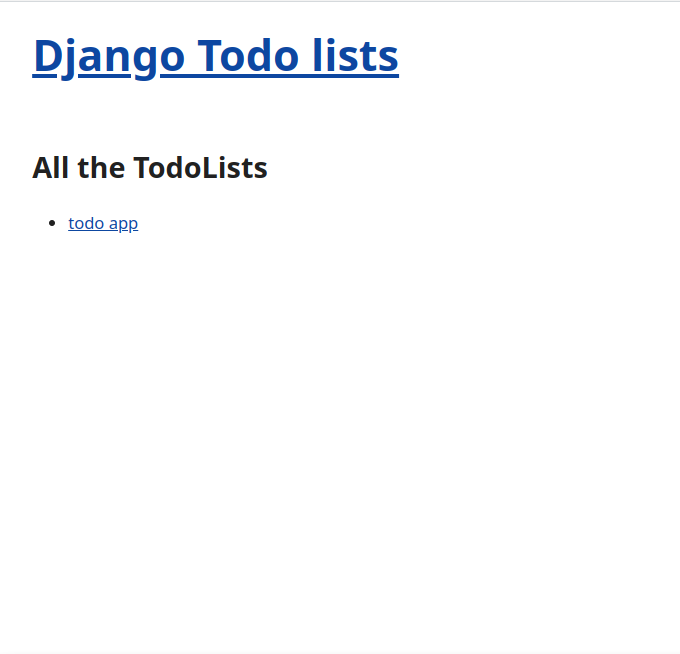
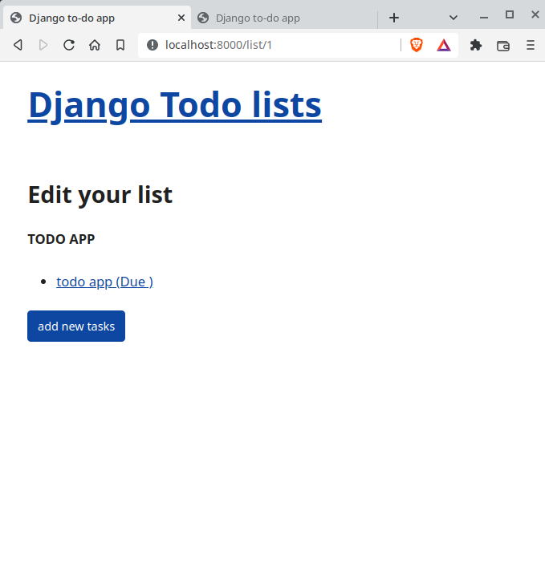

# A todo app with django

The app has two models: the TodoList model and the Task model. 
A TodoList can have many tasks. The tasks are inherent from the todolist.

# Overview
- [Basic Crud operations for a todo app.](#CRud)
- [Underlying aspects of django used.](#Django)
- [Running the app locally](#runningapp)
- [deploying the app](#Deploment)

## quick look

1. Right now we can view (read)

